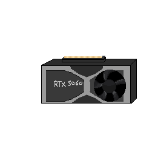

# One GPU GPT
**Have You Ever Asked Yourself: How Far Can I Go Training a GPT on my local machine?**

This is the question that I asked myself when I was trying to train a GPT model on my local **RTX 5060** GPU. I wanted to see how good of a model I could train with limited resources and many constraints.

----------------------------
## Goal 
The goal of this project is to train multiple GPT models
from scratch on a single GPU, Understand how they work, and what are their internal mechanisms. Then each time applying a more advanced modern technique to improve the model's quality and performance within the constraints of a single GPU.
